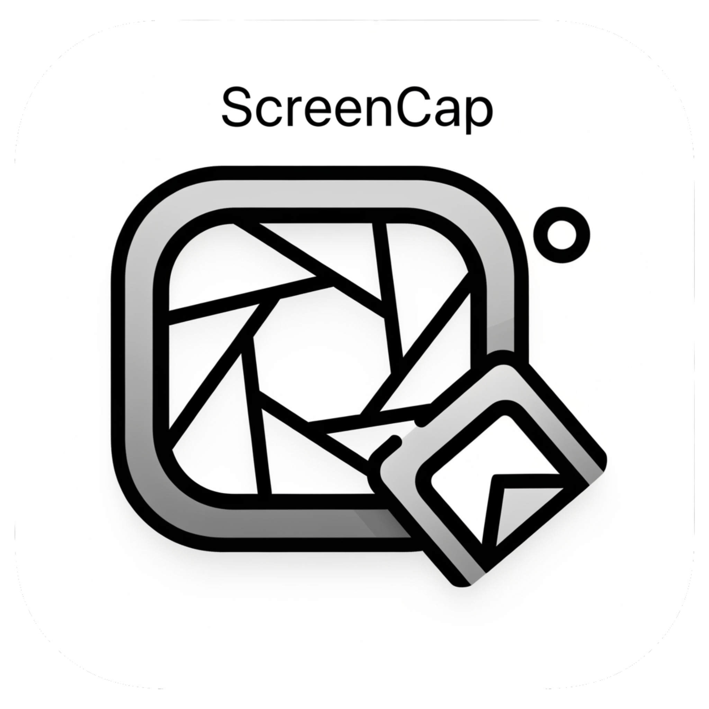

# ScreenCap

<div align="center">
  
  <h3>A powerful screenshot utility for macOS</h3>
  <p>Take screenshots with customizable file prefixes and enhanced workflow features</p>
  
  [](https://swift.org)
  [](https://developer.apple.com/macos/)
  [](LICENSE)
</div>

## ✨ Features

- **🎯 Multiple capture types**: Full screen, area selection, specific window
- **📝 Customizable file prefix**: Define your own prefix for screenshot filenames
- **⏰ Timestamp control**: Option to include or exclude date/time in filenames
- **📁 Custom save directory**: Choose where to save your screenshots
- **🖼️ Multiple formats**: Support for PNG, JPG, and JPEG
- **🔔 Notifications**: Visual confirmation when screenshots are saved
- **⌨️ Global keyboard shortcuts**: Customizable hotkeys that work system-wide
- **🎛️ Menu bar app**: Lives discretely in your menu bar
- **🪟 Floating preview window**: Draggable preview with auto-close functionality
- **🚀 Launch at login**: Optional auto-start when you boot your Mac

## 🚀 Installation

### Requirements
- macOS 14.0 or later
- Xcode Command Line Tools
- Swift 5.9+

### Building from Source

1. **Clone the repository**
   ```bash
   git clone https://github.com/javierpr0/ScreenCap.git
   cd screencap
   ```

2. **Build the application**
   ```bash
   make build
   ```

3. **Install to Applications (optional)**
   ```bash
   make install
   ```

4. **Run the application**
   ```bash
   make run
   ```

### Available Commands

- `make build` - Build the application
- `make clean` - Clean build artifacts
- `make install` - Install to /Applications (requires sudo)
- `make install-user` - Install to ~/Applications (no sudo required)
- `make run` - Run the application
- `make debug` - Run in debug mode
- `make dist` - Create DMG for distribution
- `make zip` - Create ZIP for distribution
- `make help` - Show help

## 📖 Usage

### First Run

1. When running for the first time, macOS will request permissions for:
   - Screen recording
   - File access
   - Notifications

2. **Important**: You must grant these permissions in:
   - `System Settings > Privacy & Security > Screen Recording`
   - Add ScreenCap to the list and enable it

### Configuration

1. Click the ScreenCap icon in the menu bar
2. Select "Settings..."
3. Customize:
   - **File prefix**: Text that will appear at the beginning of each screenshot
   - **Include timestamp**: Whether to include date and time in the filename
   - **Image format**: PNG, JPG, or JPEG
   - **Save directory**: Where screenshots will be saved
   - **Floating preview time**: Auto-close time for preview window
   - **Launch at login**: Start automatically when you boot your Mac

### Capture Types

- **Full screen** (⌘+Shift+1): Captures the entire screen
- **Selection** (⌘+Shift+2): Allows you to select a specific area
- **Window** (⌘+Shift+3): Captures a specific window

### Filename Examples

**With timestamp enabled:**
- `MyScreenshot_2024-01-15_14-30-25.png`

**Without timestamp:**
- `MyScreenshot_1.png`
- `MyScreenshot_2.png`
- `MyScreenshot_3.png`

### 🪟 Floating Preview Window

After each capture, a floating window appears with the captured image that you can:

- **Drag** directly to any application (Mail, Messages, Slack, etc.)
- **Close** by pressing `Esc` or waiting for auto-close (configurable)
- **Move** by clicking and dragging the window
- **Interact** with to reset the auto-close timer

The floating window:
- Automatically positions itself near the cursor
- Has visual effects when hovering
- Closes automatically after dragging the image
- Works just like the native macOS functionality

## 🛠️ Troubleshooting

### Application cannot take screenshots

1. Check permissions in `System Settings > Privacy & Security > Screen Recording`
2. Make sure ScreenCap is in the list and enabled
3. Restart the application after granting permissions

### No notifications appear

1. Go to `System Settings > Notifications`
2. Find ScreenCap and enable notifications

### Build errors

1. Verify you have Xcode Command Line Tools:
   ```bash
   xcode-select --install
   ```

2. Check Swift version:
   ```bash
   swift --version
   ```

## 🏗️ Architecture

### Project Structure

```
screencap/
├── ScreenCapApp.swift          # Main application and AppDelegate
├── ScreenshotManager.swift     # Screenshot capture and management logic
├── SettingsView.swift          # Configuration interface (SwiftUI)
├── FloatingPreviewWindow.swift # Floating preview window implementation
├── ImageDragView.swift         # Custom drag-and-drop image view
├── KeyboardShortcutNames.swift # Keyboard shortcut definitions
├── ScreenCap.entitlements      # Application permissions
├── Package.swift               # Swift Package Manager configuration
├── Makefile                    # Build and distribution scripts
└── README.md                   # This file
```

### Key Components

#### ScreenCapApp.swift
- Main application entry point
- Menu bar setup and management
- Global keyboard shortcut handling
- Settings window management

#### ScreenshotManager.swift
- Core screenshot capture logic
- File naming and saving
- Permission checking
- Notification handling
- Floating preview integration

#### SettingsView.swift
- SwiftUI-based settings interface
- Two-tab layout (General and Shortcuts)
- Real-time configuration updates
- Launch at login management

#### FloatingPreviewWindow.swift
- Borderless floating window
- Auto-positioning near cursor
- Auto-close timer functionality
- Drag-and-drop integration

#### ImageDragView.swift
- Custom NSImageView subclass
- Drag-and-drop functionality
- Visual hover effects
- Multiple pasteboard format support

### Dependencies

- **KeyboardShortcuts** (v2.3.0+): Global keyboard shortcut management
- **Sentry** (v8.53.2+): Error monitoring and reporting

## 🤝 Contributing

We welcome contributions! Here's how you can help:

### Getting Started

1. **Fork the repository**
2. **Clone your fork**
   ```bash
   git clone https://github.com/javierpr0/ScreenCap.git
   cd screencap
   ```
3. **Create a feature branch**
   ```bash
   git checkout -b feature/amazing-feature
   ```
4. **Make your changes**
5. **Test thoroughly**
   ```bash
   make build
   make run
   ```
6. **Commit your changes**
   ```bash
   git commit -m "feat: add amazing feature"
   ```
7. **Push to your branch**
   ```bash
   git push origin feature/amazing-feature
   ```
8. **Open a Pull Request**

### Development Guidelines

- Follow Swift coding conventions
- Add comments for complex logic
- Test on multiple macOS versions when possible
- Update documentation for new features
- Use conventional commit messages

### Commit Message Format

```
<type>: <description>

Types: feat, fix, docs, style, refactor, test, chore
```

## 📄 License

This project is licensed under the MIT License - see the [LICENSE](LICENSE) file for details.

## 🙏 Acknowledgments

- Built with Swift and AppKit
- Uses [KeyboardShortcuts](https://github.com/sindresorhus/KeyboardShortcuts) by Sindre Sorhus
- Error monitoring by [Sentry](https://sentry.io)
- Inspired by the need for better screenshot workflow on macOS

## 📞 Support

If you encounter any issues or have questions:

1. Check the [Troubleshooting](#-troubleshooting) section
2. Search existing [Issues](https://github.com/javierpr0/ScreenCap/issues)
3. Create a new issue with detailed information

---

<div align="center">
  Made with ❤️ for the macOS community
</div>